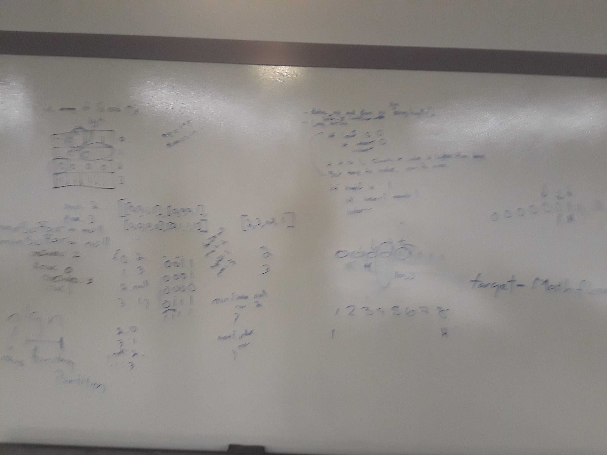

# 2d Array Challenge

[Return to List of Challenges](../../README.md)

## Challenge
Given a 2d array, with subarrays consisting of sorted 0's and 1's, find the subarrays with the lowest and highest number of 0's, and return their indexes.

## Approach & Efficiency
Uses a binary search with low and high tracking variables on each subarray to find the intersection of the last 0 and first 1.  Checks if that index is higher than the current lowest or lower than the current highest subarray indexes, and if they are, sets that subarrays index as the min or max.  At the end, returns an object with the min and max subarrays.

This binary search of each array runs for O(lgn) time, so to search all arrays would take O(n lgn) time.  Space is O(n) as only an object with the two resulting subarrays is created and returned.

## Solution
