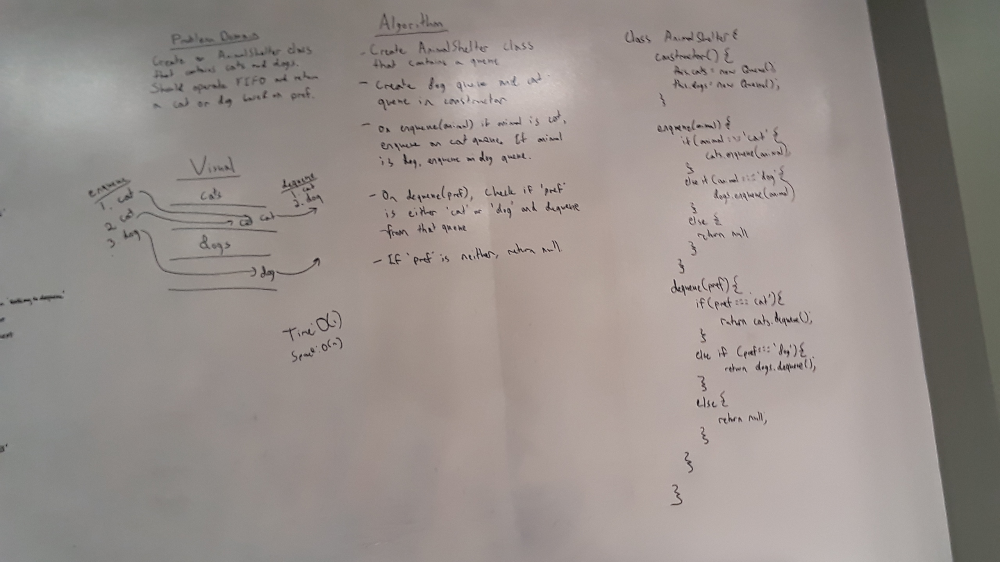

# Animal Shelter

[Return to List of Challenges](../../README.md)

## Challenge
Create an AnimalShelter class that can take in cats or dogs with an enqueue method, and return either a cat or dog depending on preference with a dequeue method.

## Approach & Efficiency
This class implements two `Queue` class objects, one for dogs and one for cats.  When `enqueue` is called with the argument 'cat', a cat is added to the cats queue.  When `enqueue` is called with the argument 'dog'. a dog is added to the dogs queue.  When `dequeue` is called with the argument of 'cat' or 'dog', one animal will be dequeued from the corresponding queue.  If no arguments are passed to either `enqueue` or `dequeue`, null will be returned.

## Whiteboard

