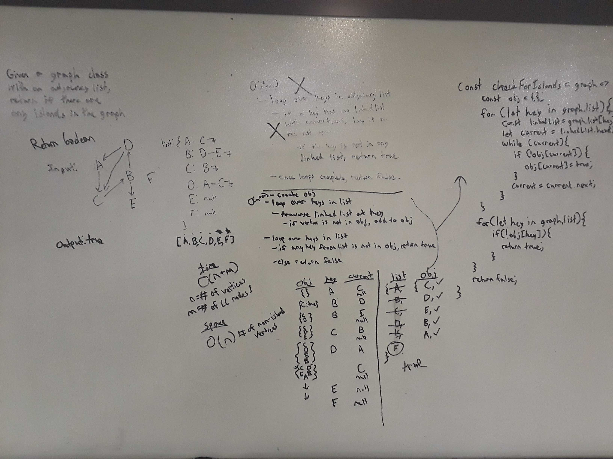

# Check for Islands in a Graph

[Return to List of Challenges](../../README.md)

## Challenge
Given a graph class with an adjacency list, write a function that determines if there are any islands in the graph.  Return a boolean.

## Approach & Efficiency
This loops over each key in the adjacency list and checks if the connection vortices are in an object for tracking all non-islands.  If it is not present, it is added.  After checking all connections of all vetices, it again loops over the adjacency list keys, and if any of those keys are not present in the non-islands object, then islands are present and true is returned.  If all vertices are checked and they are all present in the non-islands object, there are no islands and false is returned.

The time complexity is O(n + m) (Reduced from O(2n + m)).  n is each vertex in the graph is looped over twice, once to add non-islands from it's connections, and once for checking if non-islands exist.  m is the number of connections that exist across all vertices.  Space complexity is O(n), because an object is created that is the length of the sum of all non-island vertices in the graph.

## Solution
