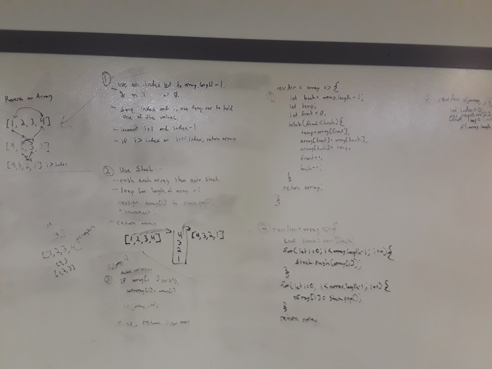

# Array Reverse Challenges

[Return to List of Challenges](../../README.md)

## Challenge
This challege is to try to find multiple ways to reverse an array.

## Approach & Efficiency
* 1. I used a while loop and two tracking variables to swap the locations of the array items in place.  One was set to zero, the other to the end of the array.  On each iteration of the loop, the one in front is set to a temp, then the rear is set to the front, the rear is set to the temp, then the front is increased by 1 while the rear is decresed by one.  When the fron is equal to or greater than the rear, the loop ends and the array is returned.

* 2. A stack is created and a for loop is used to push all of the array values into it, then another for loop is used to push each item back into the array in reverse order.

## Approach & Efficiency
* 1.  This has a space complexity of O(1) because it doesnt create any additional elements, only changes the values in place.  The time complexity is O(1/2n) where n is the number of items in the array, because the two tracking variables move towards each other in the center, running for half the number of values in the array.

## Solution
