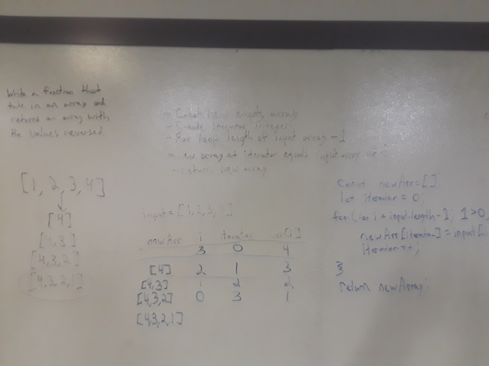

# Reverse an Array

[Return to List of Challenges](../../README.md)

## Challenge
Write a function that takes in an array, and reverses the positions of all values in the array.  Built in methods may not be used.

## Approach & Efficiency
This solution uses a for loop and an external iterator together to build a new array.  The external iterator starts at 0 to track the position for the new array, while the for loop iterates down from the input array's length.  Each time the loop completes, the external iterator goes up while the for loop iterator goes down.  The time and space is O(n).

## Solution

