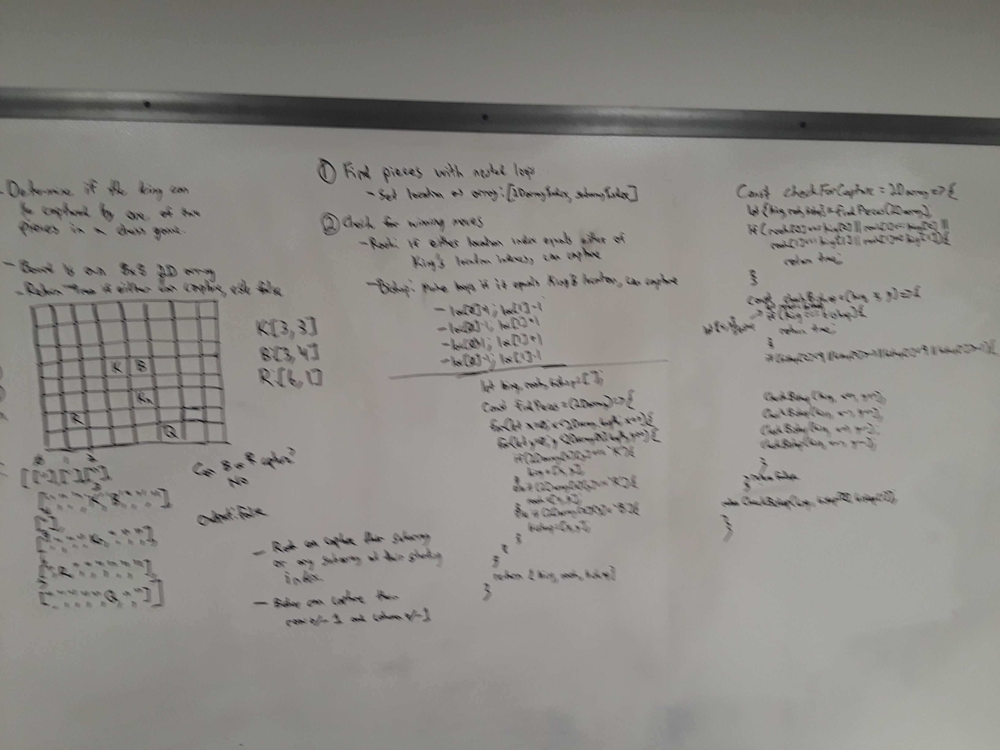

# Find Moves in Chess That Can Capture

[Return to List of Challenges](../../README.md)

## Challenge
Given a 2d array with the locations of a king, queen, bishop, rook, and knight, return a boolean for if the king is in check.

## Approach & Efficiency
This setup checks if the rook and bishop have the king in check.  First a function loops through each value of the board to locate the pieces, and returns an object of pieces with 2 element arrays representing the x and y coordinates of their locations.

The rook is can capture the king if either the x or y coordinate is shared with the king.  A conditional is used for this.

A recursive function checks the diagonals for the bishop.  First, it checks if the coordinates passed in match the location of the king, which returns true.  If not, it begins recursively calling itself, first moving x+1 and y+1 until the bounds of the board are reached, then resets the values of the bishop's coordinates and checks x+1 and y-1, etc.  If the recursive functions searches allfor diagonals and doesn't find the king's coordinates, it returns false.

The function for checking the pieces first finds them with the first function, then does the rook's conditional, then returns the result of the recursive checks on the bishop's diagonals.

The time complexity of finding the pieces is reduced to O(n).  Although the nested loops run in O(n^2) time, the board is permenently set at 8x8, which would be O(64n) which is reduced down to O(n).  Space complexity is O(n) where n is the length of the board, because the call stack is utilized to store the returns of the recursive function to check diagonals.

## Solution
