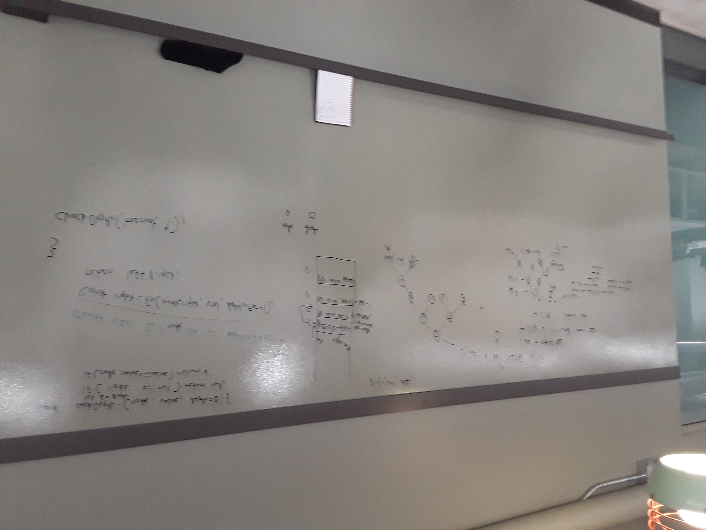

# FindDepth

[Return to List of Challenges](../../README.md)

## Challenge Description
This function uses recursion and the callstack to traverse a tree and return the depth of the node with the given value.  The base case for this function is to return null if the node is null, then to return the depth if the node's value matches the search value.

If the base case is not fulfilled, the function will declare a variable for the left node and call itself on that node and add one to the depth, which is held in a third parameter of the function.  This repeats for the right node if there is no node to the left.  At the end of the traversal, the left and right variables will both be null, or one of them will contain the depth of the value if it is found.  If found, that value will be returned, otherwise null will be returned.

## Approach & Efficiency
The function uses a preOrder recursive function to traverse the tree and check every node until the value is found, leading to a worst case time complexity of O(n).  The function calls are stored in the callstack which leads to a space complexity of O(h), where h is the height to the deepest node in the tree.

## Solution
