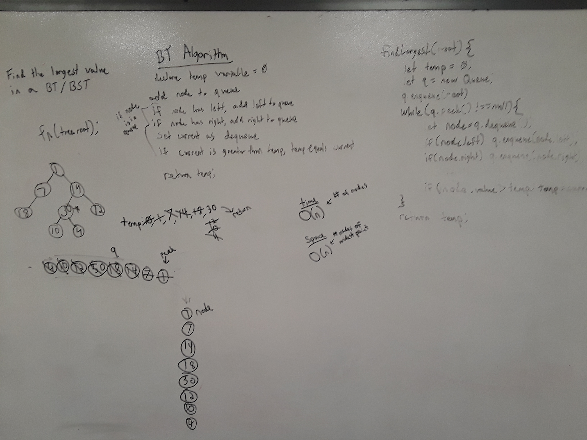

# findMax

[Return to List of Challenges](../../README.md)

## Challenge Description
Given a tree, find the maximum value in the tree and return it.

## Approach & Efficiency
This function uses a queue to perform a breadth-first traversal, and checks each node's value as they're dequeued from the queue.  If the value is larger than any value it's seen so far, it is saved to a temporary variable.  After traversing the whole tree, the value of the temporary variable will be the largest in the tree and can be returned.
The time complexity of this function is O(n) because it needs to check every node's value.  The space complexity is O(n) where n is the number of nodes in the widest level of the tree.  That is the maximum number of nodes that will be in the queue at any given time.

## Solution
