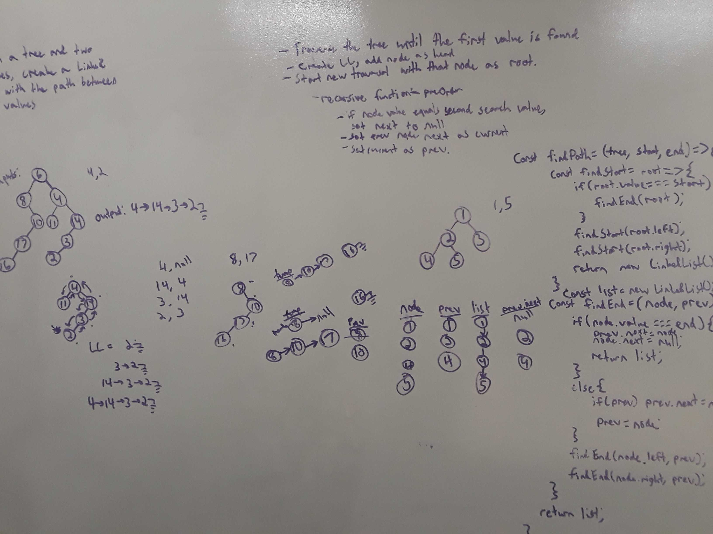

# Find Path in a Tree Between Two Values

[Return to List of Challenges](../../README.md)

## Challenge
Given a tree and two search values, return a linked list where the nodes are the path between the values in the tree.

## Approach & Efficiency
* 1. Find the start of the path by traversing the tree until the start value is found.  From this point, create a new linked list, add that node as the head, and begin a new traversal.
* 2. Recursivly traverse the tree, setting a temporary prev variable as the current node and setting that node as the previous's next.  Pass the list and the previous node along with each recursive call, repeating the process until the end value is found.  Set that nodes next as null, and return the list back up out of the function.

This has the best-case for time complexity at O(n lgn), where n is the nodes in the tree to find the start of the path, and lgn is the height of the tree.  The space complexity is O(n) where n is the number of nodes needed to complete the linked list for the path.  The worst case would be the root node to the lowest leaf node.

## Solution
