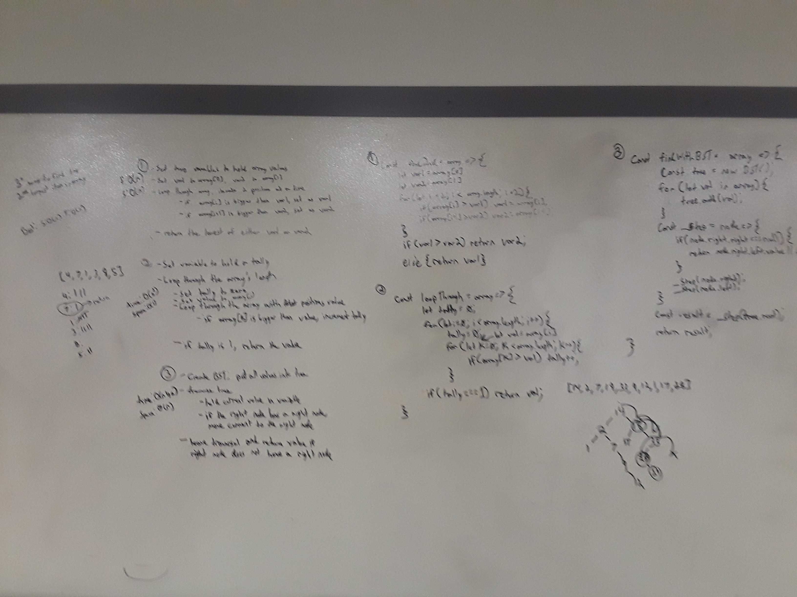
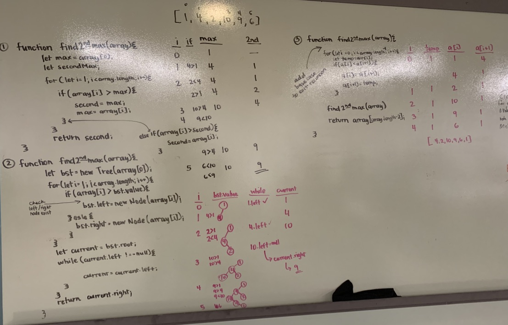

# Find Second Highest Value in an Array
## Authors: Chris and Melissa

[Return to List of Challenges](../../README.md)

## Challenge
This challege is to try to find as many ways to find the second highest value of an array.    

## Approachs & Efficiencies
* 1. Use variables to track the highest values while iterating over the array.  This has the best space and time complexity.  space: O(1) time: O(n)

* 2. Create BST and add all the values of the array into the tree, then traverse the tree to find the second highest value.  space: O(n) time(n lgn)

* 3. Create a tally and iterate each value of the array with every other value.  Increment the tally if the number in the array is greater than the value, and return the value if its' tally is 1.  space: O(1)
time: O(n^2)

* 4. Use recursion to sort the array and return the second to last index. space: O(n) because it uses the call stack. time: O(n^2)

## Solution - Chris

## Solution - Melissa
