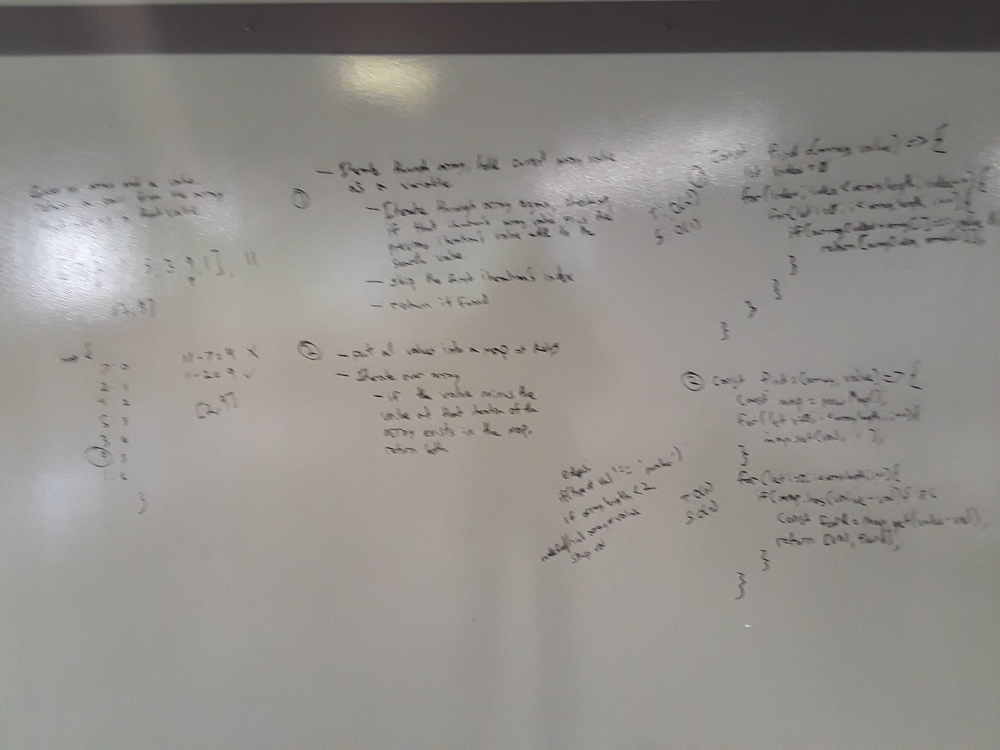

# Find a Value by Summing Array Values

[Return to List of Challenges](../../README.md)

## Challenge
Take an array and a search value, and return two values from the array that add up to the search value.

## Approach & Efficiency
* 1. Loop through the array, placing all items onto a map with the value as the key and the array index as the value.  Loop through again, checking if the map contains the remainder of the search value and the value at the current array index.  If it does, and the value from the map doesnt match that array index, return the remainder and map key together as an array.

This has the best-case for time complexity at O(2n) = O(n), where n is the number of items in the array.  The space complexity is also O(n), as a map of the same length as the array must be created.

## Solution
