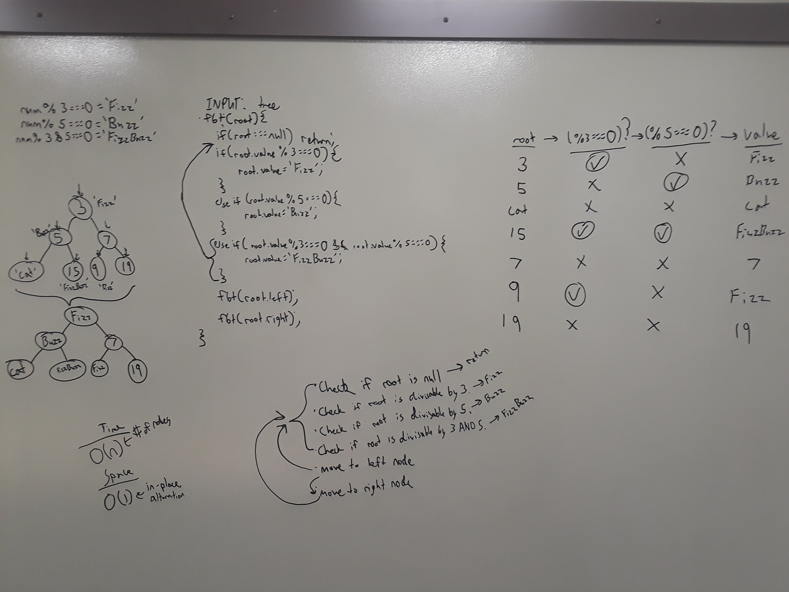

# FizzBuzz

[Return to List of Challenges](../../README.md)

## Challenge Description
Given a binary tree, traverse the tree and replace all numbers divisible by 3 with 'Fizz', numbers divisible by 5 with 'Buzz', and numbers divisible by 3 and 5 with 'FizzBuzz'.

## Approach & Efficiency
The function uses a preOrder recursive function to traverse the tree and checks for a mod (%) of 0 to replace the numbers. 

## Solution
