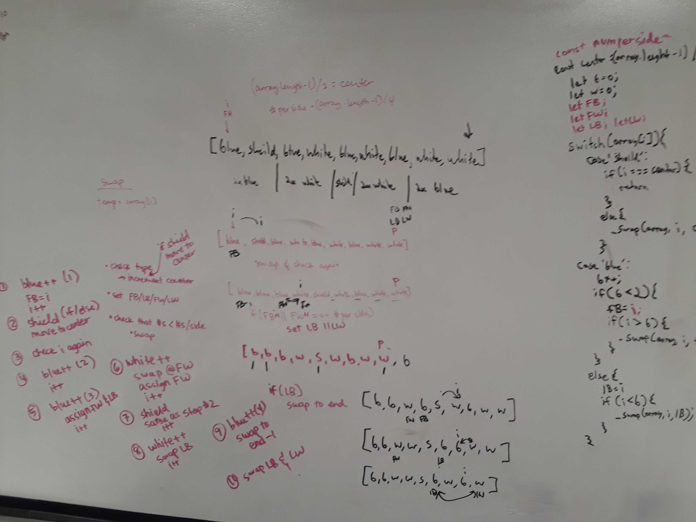

# Use Quicksort to Create a Flag
## Authors: Chris and Melissa

[Return to List of Challenges](../../README.md)

## Challenge
We are given an array with a certain number of values as `blue`, a certain number as `white`, and one value as `sheild`.  Return the array sorted in place with O(n) time that has `shield` in the center, `white`s surrounding `shield`, and `blue`s surrounding `white`s to replicate the Salvadoran flag.

## Approach & Efficiency
This uses quicksort, but rather than sorting numbers, it checks the value with a switch case for `blue`, `white`, or `center`.  Tracking variables are used for firstBlue, lastBlue, firstWhite, and lastWhite in order to mark where each color should begin or end.  If `shield` is found, it is moved to the center.  After iterating over each value in the array and sorting where neccessary, the array is returned.

Time complexity is O(n) where n is the number of values in the array.  It checks each position to see if it has the correct value in that place.  Space complexity is O(1) because it alters the array in place and returns it in the end.

## Solution
