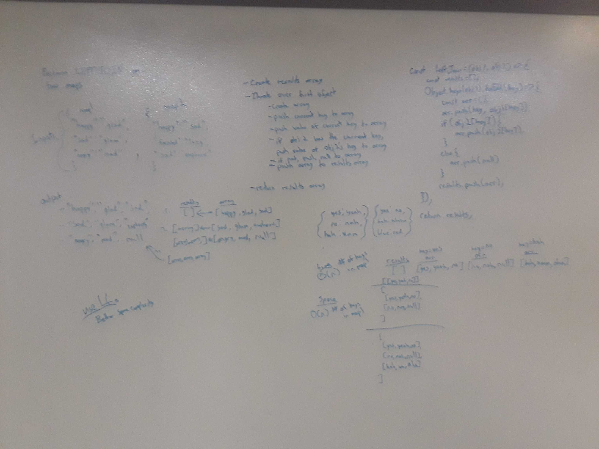

# Perform a 'Left Join' on Two Objects

[Return to List of Challenges](../../README.md)

## Challenge
Given two objects, perform a left join by creating an output that groups the first object's key and value with the second object's value if it has the same key.  Keys in the second object that do not exists in the first will be added as `null`.

## Approach & Efficiency
This approach creates an output array, then iterates over the keys of the first object.  Another subarray is created and the key is pushed to this subarray, followed by it's value.  The second object is checked for the same key, and if it's there it's value is pushed to the subarray.  If not, null is pushed instead.  Once the iterations over the key is complete, the subarray is pushed to the results array, which is returned when all keys of the first object are complete.

Time complexity is O(n) where n is the number of keys in the first object.  Space complexity is O(n), which is reduced from O(3n) where n is the keys and values of the first object, and the values of the second object.  This can be lowered by using an in-place function, but as the objects represent data as in SQL tables, I feel it is better to not manipulate the original data and instead return a new structure.

## Solution
