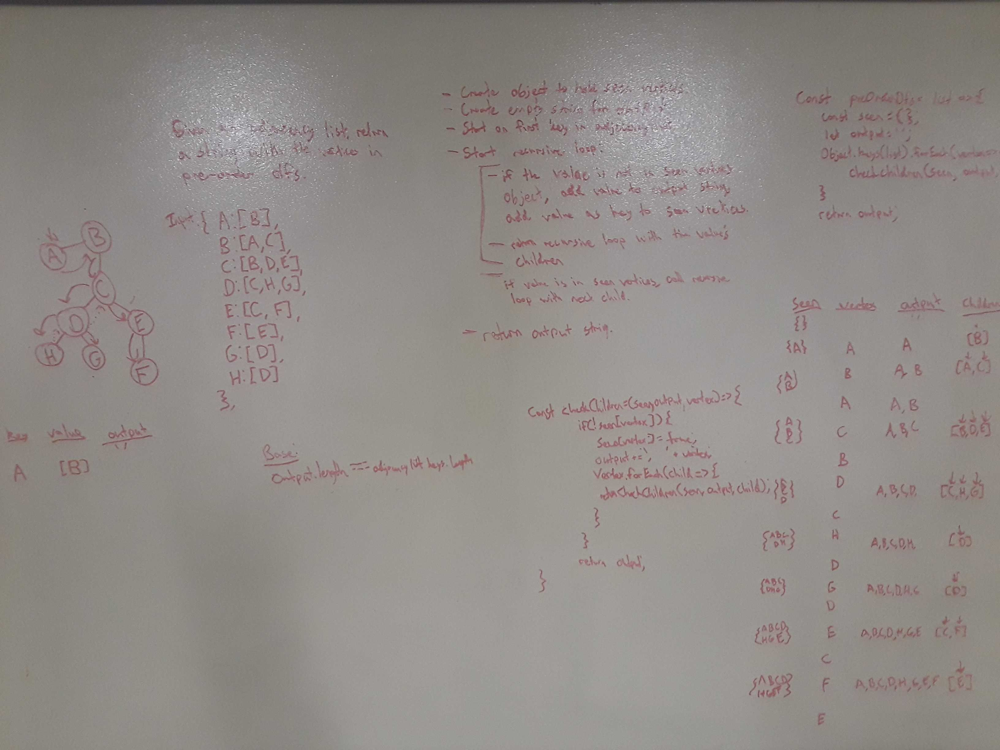

# Graph - PreOrder DFS

[Return to List of Challenges](../../README.md)

## Challenge
Given an adjacency list as a graph, return a string with the vertices in preOrder depth-first.

## Approach & Efficiency
This approach makes use of two functions.  One function creates an object to hold seen vertices and an output string, then calls the recursive checkChilren function on each key of the adjacency list.  The checkChildren function checks if that vertex is already in the the seen vertices object.  If not, it adds the vertex as a key and appends the value to the output, then calls the same checkChildren function on it's children.  

Time complexity is O(n*m) where n is the number of vertices and m is the number of edges between all vertices.  Space complexity is O(n) because an object is created with the length of the number of vertices.

## Solution
